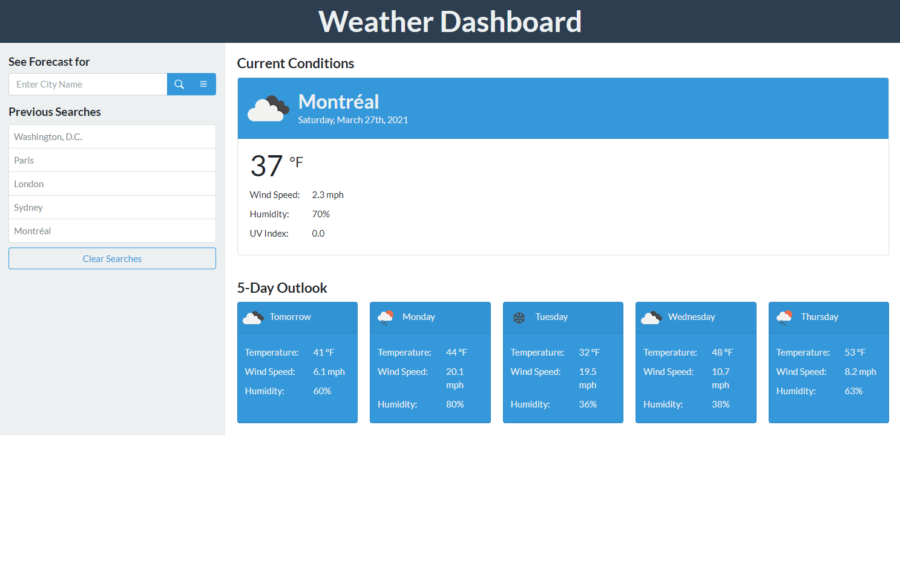

# **Web Weather Dashboard**

&nbsp;
## **Description**
Travel Weather Dashboard provides a weather search portal for global city locations, returning current conditions and a 5-day forecast. The application saves recently searched cities and the selected units for data display (imperial or metric, imperial is default for new users). Returning users can quickly select previously searched locations for an updated forecast. 

The website is created with HTML and styled using the Bootstrap front-end toolkit plus additional custom CSS. The site's theme is provided using the openly available [bootstrap theme Flatly](https://bootswatch.com/flatly/). Site functionality is implement using JavaScript and uses jQuery and Moment.js for specific functionality. Weather data is retrieved through the [Open Weather API](https://openweathermap.org/api). 

Travel Weather Dashboard is built as a client-side only single page web application and dynamically displays weather data to the page provided a response is received from the API. The site uses the geocoding API and One Call API from open weather. The Geocoding API is used first given a city name to search for latitude and longitude coordinates for that city which are then used in the One Call API to retrieved weather data for the passed latitude and longitude coordinates. 

&nbsp;
## **[Live Application](https://spfave.github.io/web-weather-dashboard/)**

Demo interaction \

&nbsp;
## **Technologies and Services**
Web Technologies
- HTML5, CSS, and JavaScript
- Local Storage
- AJAX using promises and async/await

External Frameworks and Services
- [Bootstrap](https://getbootstrap.com/) front-end styling toolkit
- [Bootswatch Flatly Theme](https://bootswatch.com/flatly/) bootstrap theme
- [icons8](https://icons8.com/) - <a target="_blank" href="https://icons8.com/icons/set/partly-cloudy-day">Partly Cloudy Day icon</a>
- [OpenWeather API](https://openweathermap.org/api): Geocoding API, One Call API
- [jQuery](https://jquery.com/) 
- [Moment.js](https://momentjs.com/)
